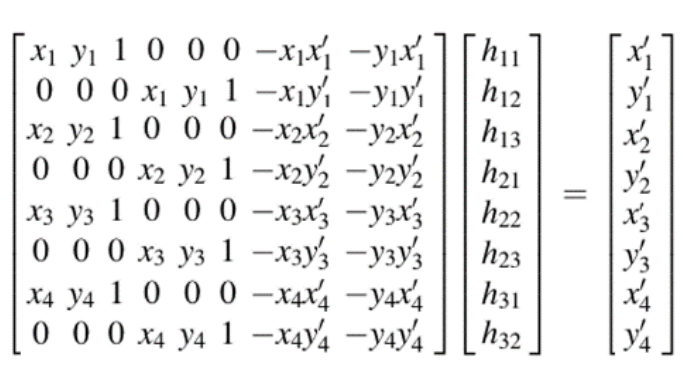

# perspective-transformation-cuda
## Environment
OS: Windows 10  
CPU: AMD Ryzen 5 3600 6-Core Processor  
GPU: NVIDIA GeForce GTX 1660 SUPER  
CUDA: 11.1  
## Introduction
Perspective Transform is very useful if you want to scan the paper on the table.  
It transforms the selected grid to the destination image.  
Which is just like you are looking at the selected grid from another perspective.  
  
This project compares the execution time of this function running on CPU and GPU.  
source | destination
--- | ---
 | 
## Method
$$ \begin{bmatrix}
    x' \\
    y' \\
    1 \\
    \end{bmatrix}
    \sim
    \begin{bmatrix} 
   h_{11} & h_{12} & h_{13} \\
   h_{21} & h_{22} & h_{23} \\
   h_{31} & h_{32} & h_{33} \\
   \end{bmatrix}
   \begin{bmatrix}
    x \\
    y \\
    1 \\
    \end{bmatrix} $$
    
$$x'= \frac{h_{11}x+h_{12}y+h_{13}}{h_{31}x+h_{32}y+h_{33}}$$

$$y'= \frac{h_{21}x+h_{22}y+h_{23}}{h_{31}x+h_{32}y+h_{33}}$$

  

  
Solve the h matrix above then map the pixel from source to destination.  
The source image will be divided into blocks based on the size of the image and the CUDA resources on the GPU.  
Which makes the task able to run parallelly.
## Result
This project implements the function by forward mapping: source->destination.  
Which causes the black strips in the destination.  
There are two ways to eliminate the black strips.  
1. Do it by inverse mapping: scan the destination and copy the source pixel value.  
2. Use the neighbor pixel to interpolate pixels in the black strips.

|  | execution time (second) | speedup |
| :---: | :---: |  :---: |
| CPU | 0.027 |  |
| GPU | 0.0072 | 3.7 |
## How to use
### Windows
CPU:  
$ nvcc -o {output_file} perspective_transformation_CPU.cu -arch=sm_75  
$ {output_file}.exe  
GPU:  
$ nvcc -o {output_file} perspective_transformation_GPU_device1.cu -arch=sm_75  
$ {output_file}.exe  
### Linux
CPU:  
$ ./compile_cpu.sh  
GPU:  
$ ./compile_gpu_1.sh  
