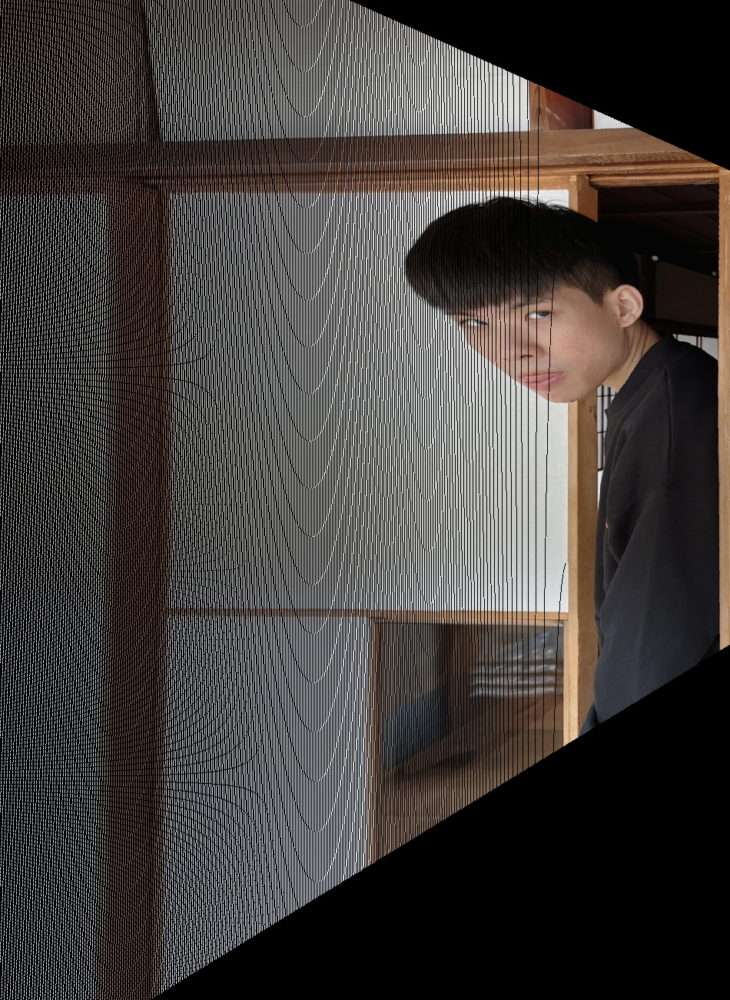

# perspective-transformation-cuda
## Environment
OS: Windows 10 
CPU: AMD Ryzen 5 3600 6-Core Processor 
GPU: NVIDIA GeForce GTX 1660 SUPER 
CUDA: 11.1 
## Introduction
Perspective Transform is very useful if you want to scan the paper on the table. 
It transforms the selected grid to the destination image. 
Which is just like you are looking at the selected grid from another perspective. 
 
This project compares the execution time of this function running on CPU and GPU. 
origin | result
--- | ---
 | 
