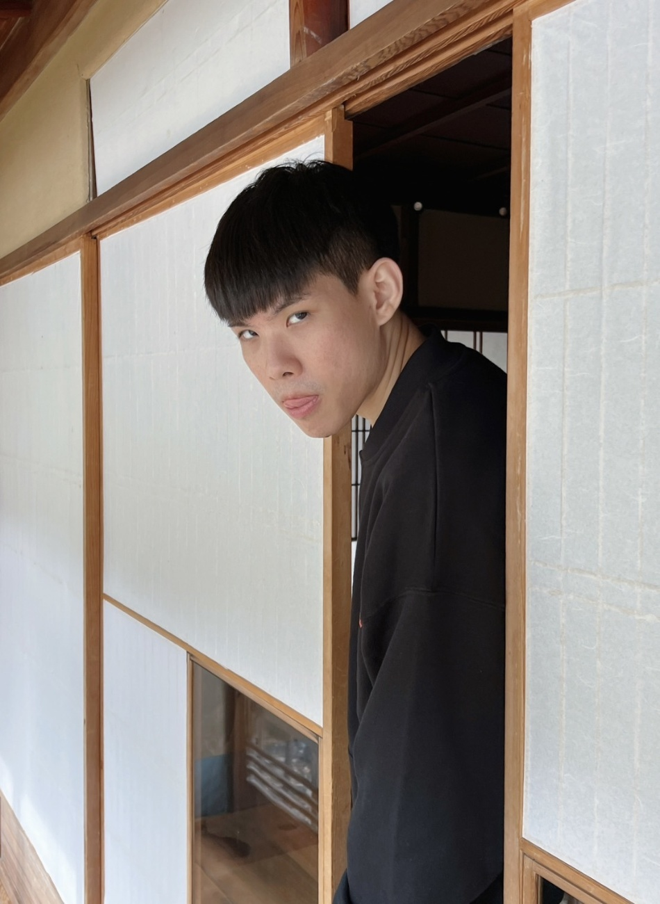

# perspective-transformation-cuda
## Environment
OS: Windows 10  
CPU: AMD Ryzen 5 3600 6-Core Processor  
GPU: NVIDIA GeForce GTX 1660 SUPER  
CUDA: 11.1  
## Introduction
Perspective Transform is very useful if you want to scan the paper on the table.  
It transforms the selected grid to the destination image.  
Which is just like you are looking at the selected grid from another perspective.  
  
This project compares the execution time of this function running on CPU and GPU.  
origin | result
--- | ---
 | 
## Method
$$ \begin{bmatrix}
    x' \\
    y' \\
    1 \\
    \end{bmatrix}
    \sim
    \begin{bmatrix} 
   h_{11} & h_{12} & h_{13} \\
   h_{21} & h_{22} & h_{23} \\
   h_{31} & h_{32} & h_{33} \\
   \end{bmatrix}
   \begin{bmatrix}
    x \\
    y \\
    1 \\
    \end{bmatrix} $$
    
$$x'= \frac{h_{11}x+h_{12}y+h_{13}}{h_{31}x+h_{32}y+h_{33}}$$

$$y'= \frac{h_{21}x+h_{22}y+h_{23}}{h_{31}x+h_{32}y+h_{33}}$$

  

## Result
This project implements the function by forward mapping: origin->result.  
Which causes the black strips in the result.  
There are two ways to eliminate the black strips.  
1. Do it by inverse mapping: scan the destination and copy the source pixel value.  
2. Use the neighbor pixel to interpolate pixels in the black strips.

|  | execution time (second) | speedup |
| :---: | :---: |  :---: |
| CPU | 0.027 |  |
| GPU | 0.0072 | 3.7 |

